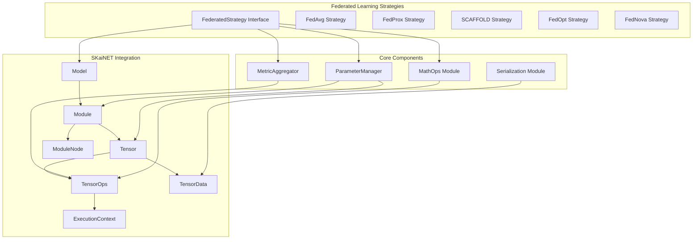
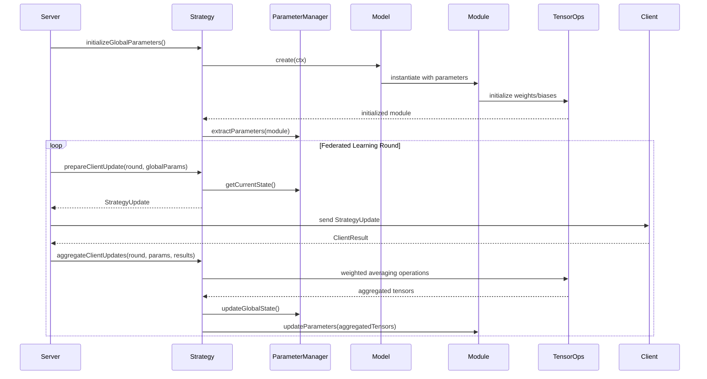

# Design Document: Federated Learning Strategies

## Overview

This design document outlines the implementation of federated learning (FL) strategies in Kotlin Multiplatform using SKaiNET's Tensor API and Neural Network DSL. The system provides a mathematical foundation for various federated learning algorithms, with the primary deliverable being "The Federated Calculator" MVP featuring a robust FedAvg implementation.

The architecture leverages SKaiNET's compositional design, separating data representation (`TensorData<T, V>`) from mathematical operations (`TensorOps`), and utilizing the Model/Module architecture for neural network management. This enables cross-platform consistency, backend flexibility, and seamless integration with SKaiNET's neural network ecosystem.

## Architecture

### High-Level Architecture



### Strategy Execution Flow



## Components and Interfaces

### Core Strategy Interface

```kotlin
interface FederatedStrategy {
    /**
     * Initialize global model parameters from a SKaiNET Model instance
     */
    suspend fun initializeGlobalParameters(
        ctx: ExecutionContext,
        model: Model<FP32, Float, *, *>
    ): GlobalParameters
    
    /**
     * Prepare mathematical state for client update
     */
    suspend fun prepareClientUpdate(
        ctx: ExecutionContext,
        round: Int,
        globalParameters: GlobalParameters
    ): StrategyUpdate
    
    /**
     * Aggregate client updates using mathematical operations
     */
    suspend fun aggregateClientUpdates(
        ctx: ExecutionContext,
        round: Int,
        currentGlobalParameters: GlobalParameters,
        clientResults: List<ClientResult>
    ): GlobalParameters
    
    /**
     * Aggregate evaluation metrics from clients
     */
    suspend fun evaluateGlobalModel(
        ctx: ExecutionContext,
        round: Int,
        globalParameters: GlobalParameters,
        evaluationResults: List<EvaluationResult>
    ): AggregatedMetrics
}
```

### Data Models

```kotlin
/**
 * Represents global model parameters as SKaiNET tensors extracted from Module
 */
data class GlobalParameters(
    val weights: Map<String, Tensor<FP32, Float>>,
    val round: Int,
    val metadata: Map<String, Any> = emptyMap()
)

/**
 * Mathematical state prepared for client updates
 */
data class StrategyUpdate(
    val globalWeights: Map<String, Tensor<FP32, Float>>,
    val strategySpecificData: Map<String, Tensor<FP32, Float>> = emptyMap(),
    val round: Int
)

/**
 * Client training results with tensor updates
 */
data class ClientResult(
    val clientId: String,
    val weightUpdates: Map<String, Tensor<FP32, Float>>,
    val sampleCount: Int,
    val trainingLoss: Float,
    val strategySpecificData: Map<String, Tensor<FP32, Float>> = emptyMap()
)
```

### Parameter Manager

```kotlin
class ParameterManager(private val ctx: ExecutionContext) {
    private val globalState = mutableMapOf<String, Tensor<FP32, Float>>()
    private val historicalStates = mutableListOf<Map<String, Tensor<FP32, Float>>>()
    private val strategyBuffers = mutableMapOf<String, Tensor<FP32, Float>>()
    
    /**
     * Initialize global parameters from a SKaiNET Model instance
     */
    suspend fun initializeParameters(model: Model<FP32, Float, *, *>): GlobalParameters {
        val module = model.create(ctx)
        val weights = extractParametersFromModule(module)
        
        globalState.clear()
        globalState.putAll(weights)
        return GlobalParameters(weights, round = 0)
    }
    
    /**
     * Extract parameters from a SKaiNET Module using ModuleNode interface
     */
    private fun extractParametersFromModule(module: Module<FP32, Float>): Map<String, Tensor<FP32, Float>> {
        val parameters = mutableMapOf<String, Tensor<FP32, Float>>()
        
        // Extract parameters from current module
        module.params.forEach { param ->
            parameters[param.name] = param.value as Tensor<FP32, Float>
        }
        
        // Recursively extract from child modules
        module.children.forEach { child ->
            val childParams = extractParametersFromModule(child as Module<FP32, Float>)
            childParams.forEach { (name, tensor) ->
                parameters["${child.name}.$name"] = tensor
            }
        }
        
        return parameters
    }
    
    /**
     * Update Module parameters with new tensor values
     */
    suspend fun updateModuleParameters(
        module: Module<FP32, Float>,
        newParameters: Map<String, Tensor<FP32, Float>>
    ) {
        // Update parameters in current module
        module.params.forEach { param ->
            newParameters[param.name]?.let { newValue ->
                // Update parameter tensor data
                param.value = newValue
            }
        }
        
        // Recursively update child modules
        module.children.forEach { child ->
            val childModule = child as Module<FP32, Float>
            val childParams = newParameters.filterKeys { it.startsWith("${child.name}.") }
                .mapKeys { it.key.removePrefix("${child.name}.") }
            
            if (childParams.isNotEmpty()) {
                updateModuleParameters(childModule, childParams)
            }
        }
    }
    
    /**
     * Update global state with new parameters
     */
    suspend fun updateGlobalState(
        newParameters: Map<String, Tensor<FP32, Float>>,
        round: Int
    ): GlobalParameters {
        // Store historical state
        historicalStates.add(globalState.toMap())
        
        // Update current state
        globalState.clear()
        globalState.putAll(newParameters)
        
        return GlobalParameters(newParameters, round)
    }
    
    /**
     * Get strategy-specific buffer or create if not exists
     */
    suspend fun getOrCreateBuffer(
        name: String,
        shape: Shape,
        initialValue: Float = 0f
    ): Tensor<FP32, Float> {
        return strategyBuffers.getOrPut(name) {
            ctx.full(shape, FP32::class, initialValue)
        }
    }
}
```

### Mathematical Operations Module

```kotlin
class MathOps(private val ctx: ExecutionContext) {
    private val ops = ctx.ops
    
    /**
     * Compute weighted average of client updates
     */
    suspend fun weightedAverage(
        clientUpdates: List<Tensor<FP32, Float>>,
        weights: List<Float>
    ): Tensor<FP32, Float> {
        require(clientUpdates.isNotEmpty()) { "Client updates cannot be empty" }
        require(clientUpdates.size == weights.size) { "Updates and weights size mismatch" }
        
        val totalWeight = weights.sum()
        val normalizedWeights = weights.map { it / totalWeight }
        
        // Initialize result with first weighted update
        var result = ops.mulScalar(clientUpdates[0], normalizedWeights[0])
        
        // Add remaining weighted updates
        for (i in 1 until clientUpdates.size) {
            val weightedUpdate = ops.mulScalar(clientUpdates[i], normalizedWeights[i])
            result = ops.add(result, weightedUpdate)
        }
        
        return result
    }
    
    /**
     * Compute L2 norm of tensor
     */
    suspend fun l2Norm(tensor: Tensor<FP32, Float>): Float {
        val squared = ops.multiply(tensor, tensor)
        val sum = ops.sum(squared, keepDims = false)
        return kotlin.math.sqrt(sum.data.getScalar())
    }
    
    /**
     * Add proximal term for FedProx
     */
    suspend fun addProximalTerm(
        localUpdate: Tensor<FP32, Float>,
        globalParams: Tensor<FP32, Float>,
        mu: Float
    ): Tensor<FP32, Float> {
        val diff = ops.subtract(localUpdate, globalParams)
        val proximalTerm = ops.mulScalar(diff, mu)
        return ops.add(localUpdate, proximalTerm)
    }
    
    /**
     * Compute momentum update for adaptive optimizers
     */
    suspend fun momentumUpdate(
        gradient: Tensor<FP32, Float>,
        momentum: Tensor<FP32, Float>,
        beta: Float
    ): Tensor<FP32, Float> {
        val scaledMomentum = ops.mulScalar(momentum, beta)
        val scaledGradient = ops.mulScalar(gradient, 1f - beta)
        return ops.add(scaledMomentum, scaledGradient)
    }
    
    /**
     * Compute variance update for Adam-like optimizers
     */
    suspend fun varianceUpdate(
        gradient: Tensor<FP32, Float>,
        variance: Tensor<FP32, Float>,
        beta: Float
    ): Tensor<FP32, Float> {
        val gradientSquared = ops.multiply(gradient, gradient)
        val scaledVariance = ops.mulScalar(variance, beta)
        val scaledGradSquared = ops.mulScalar(gradientSquared, 1f - beta)
        return ops.add(scaledVariance, scaledGradSquared)
    }
}
```

## Data Models

### Tensor Serialization

```kotlin
/**
 * Serializable representation of tensor data
 */
@Serializable
data class SerializableTensorData(
    val shape: List<Int>,
    val dtype: String,
    val data: ByteArray
) {
    companion object {
        fun fromTensor(tensor: Tensor<FP32, Float>): SerializableTensorData {
            return SerializableTensorData(
                shape = tensor.shape.dimensions.toList(),
                dtype = "FP32",
                data = tensor.data.toByteArray()
            )
        }
    }
    
    fun toTensor(ctx: ExecutionContext): Tensor<FP32, Float> {
        return ctx.fromByteArray(
            data = data,
            shape = Shape(shape.toIntArray()),
            dtype = FP32::class
        )
    }
}

/**
 * Serializable strategy state for cross-device exchange
 */
@Serializable
data class SerializableStrategyState(
    val globalWeights: Map<String, SerializableTensorData>,
    val strategyBuffers: Map<String, SerializableTensorData>,
    val round: Int,
    val metadata: Map<String, String>
)
```

Now I need to use the prework tool to analyze the acceptance criteria before writing the Correctness Properties section:

<function_calls>
<invoke name="prework">
<parameter name="featureName">federated-learning-strategies

## Correctness Properties

*A property is a characteristic or behavior that should hold true across all valid executions of a system—essentially, a formal statement about what the system should do. Properties serve as the bridge between human-readable specifications and machine-verifiable correctness guarantees.*

Based on the prework analysis, I've identified several key properties that can be tested through property-based testing. After reviewing for redundancy, the following properties provide comprehensive coverage without overlap:

### Property 1: FedAvg Weighted Averaging Correctness
*For any* set of client model updates with corresponding sample sizes, the FedAvg aggregation should produce a weighted average where each client's contribution is proportional to their sample size.
**Validates: Requirements 2.1, 2.2**

### Property 2: Tensor Operations Consistency
*For any* tensor operations performed through the MathOps module, all computations should use only SKaiNET TensorOps and produce mathematically correct results.
**Validates: Requirements 1.5, 4.1**

### Property 3: Parameter Type Safety
*For any* global parameters managed by the system, all model weights should be represented as SKaiNET Tensor objects with appropriate shapes and data types.
**Validates: Requirements 2.3, 3.1**

### Property 4: Round Trip Serialization
*For any* valid tensor data, serializing then deserializing should produce an equivalent tensor with identical numerical values.
**Validates: Requirements 6.1, 6.2**

### Property 5: Mathematical Norm Properties
*For any* tensor, computed norms (L2, Frobenius) should satisfy mathematical properties such as the triangle inequality and positive scaling.
**Validates: Requirements 4.3**

### Property 6: Weighted Mean Aggregation
*For any* set of tensors and corresponding weights, the weighted mean should satisfy mathematical properties of weighted averages.
**Validates: Requirements 4.2, 7.1**

### Property 7: Proximal Term Correctness
*For any* local update and global parameters, adding a proximal term should modify the update by a factor proportional to the regularization parameter.
**Validates: Requirements 5.1**

### Property 8: Momentum Update Properties
*For any* gradient and momentum tensors, momentum updates should satisfy the exponential moving average properties with the specified beta parameter.
**Validates: Requirements 4.4, 5.3**

### Property 9: Historical State Preservation
*For any* sequence of parameter updates, the ParameterManager should correctly store and retrieve historical states in chronological order.
**Validates: Requirements 3.2, 3.3**

### Property 10: Deterministic Operations
*For any* tensor operation with identical inputs, repeated executions should produce identical outputs when using deterministic algorithms.
**Validates: Requirements 8.3**

### Property 11: Strategy Composition Correctness
*For any* composed strategy, the result should maintain the mathematical properties of the base strategy while incorporating enhancements.
**Validates: Requirements 9.1, 9.5**

### Property 12: Metric Aggregation Robustness
*For any* set of client evaluation results (including missing or invalid entries), metric aggregation should handle edge cases gracefully and produce valid statistical summaries.
**Validates: Requirements 7.4, 7.5**

### Property 13: Buffer Reuse Safety
*For any* tensor buffer reuse operations, the mathematical correctness of computations should be preserved regardless of buffer optimization.
**Validates: Requirements 10.2**

## Error Handling

### Tensor Operation Errors
- **Shape Mismatch**: Validate tensor shapes before operations and provide clear error messages
- **Data Type Incompatibility**: Ensure consistent data types across tensor operations
- **Memory Allocation Failures**: Handle out-of-memory conditions gracefully with fallback strategies

### Strategy Execution Errors
- **Invalid Client Results**: Validate client updates for NaN/Inf values and handle corrupted data
- **Round Synchronization**: Detect and handle round number mismatches between clients and server
- **Strategy State Corruption**: Implement checkpointing and recovery mechanisms for strategy state

### Serialization Errors
- **Malformed Data**: Validate serialized tensor data before deserialization
- **Version Compatibility**: Handle schema evolution for cross-platform compatibility
- **Network Failures**: Implement retry mechanisms with exponential backoff

### Mathematical Errors
- **Numerical Instability**: Detect and handle numerical overflow/underflow in computations
- **Division by Zero**: Validate denominators in weighted averaging operations
- **Convergence Issues**: Monitor for divergent behavior in adaptive optimizers

## Testing Strategy

### Dual Testing Approach
The system employs both unit testing and property-based testing as complementary approaches:

**Unit Tests** focus on:
- Specific examples that demonstrate correct behavior
- Interface compliance and method signatures
- Integration points between components
- Edge cases and error conditions

**Property-Based Tests** focus on:
- Universal properties that hold for all inputs
- Comprehensive input coverage through randomization
- Mathematical correctness across diverse scenarios
- Cross-validation with reference implementations

### Property-Based Testing Configuration
- **Testing Framework**: Kotest Property Testing for Kotlin Multiplatform
- **Minimum Iterations**: 100 iterations per property test
- **Test Tagging**: Each property test references its design document property
- **Tag Format**: `Feature: federated-learning-strategies, Property {number}: {property_text}`

### Testing Implementation Guidelines
- Each correctness property is implemented by a single property-based test
- Property tests generate diverse input scenarios using smart generators
- Unit tests complement property tests by covering specific integration scenarios
- All tests run in `commonTest` to ensure cross-platform consistency

### Reference Implementation Validation
- FedAvg implementation validated against NumPy reference for bit-perfect accuracy
- Advanced strategies compared with published algorithm specifications
- Cross-platform numerical consistency verified through automated testing

### Performance Testing
- Memory usage profiling during large model aggregation
- Computational performance benchmarking on mobile hardware
- Serialization efficiency testing for network optimization
- Concurrent access testing for thread safety validation