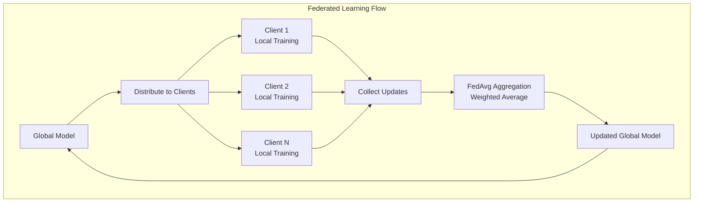
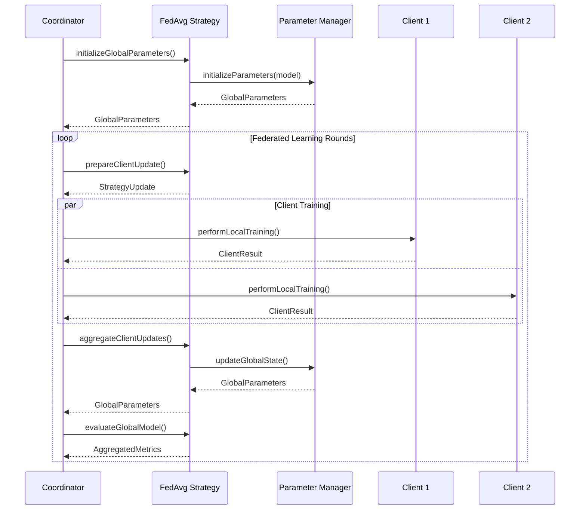

# Getting Started: FedAvg Strategy with MLP on Android

This guide demonstrates how to implement federated learning using the **FedAvg (Federated Averaging)** strategy with a Multi-Layer Perceptron (MLP) on Android using SKaiNET-FED.

## Overview

FedAvg is the foundational federated learning algorithm that performs weighted averaging of client model updates. Each client's contribution is proportional to their number of training samples, ensuring fair representation in the global model.



## Prerequisites

### Dependencies

Add the following to your Android app's `build.gradle.kts`:

```kotlin
dependencies {
    implementation("sk.ainet:skainet-fed-core:1.0.0")
    implementation("sk.ainet:skainet-lang-core:1.0.0")
    implementation("sk.ainet:skainet-backend-cpu:1.0.0")
    
    // Coroutines for async operations
    implementation("org.jetbrains.kotlinx:kotlinx-coroutines-android:1.10.2")
}
```

### Permissions

Add network permissions to your `AndroidManifest.xml`:

```xml
<uses-permission android:name="android.permission.INTERNET" />
<uses-permission android:name="android.permission.ACCESS_NETWORK_STATE" />
```

## Step 1: Define Your MLP Model

Create a simple Multi-Layer Perceptron using SKaiNET's Neural Network DSL:

```kotlin
import sk.ainet.fed.core.types.*
import sk.ainet.lang.model.ModelCard
import sk.ainet.lang.nn.definition

class SimpleMLP : Model<FP32, Float, Tensor<FP32, Float>, Tensor<FP32, Float>> {
    
    override fun create(ctx: ExecutionContext): Module<FP32, Float> = definition {
        network(ctx) {
            sequential<FP32, Float> {
                stage("input") {
                    // Flatten input (e.g., 28x28 images to 784 features)
                    flatten()
                }
                stage("hidden1") {
                    dense(outputDimension = 128)
                    activation { it.relu() }
                }
                stage("hidden2") {
                    dense(outputDimension = 64)
                    activation { it.relu() }
                }
                stage("output") {
                    dense(outputDimension = 10) // 10 classes for classification
                    activation { it.softmax(dim = 1) }
                }
            }
        }
    }

    override suspend fun calculate(
        module: Module<FP32, Float>,
        inputValue: Tensor<FP32, Float>,
        ctx: ExecutionContext,
        reportProgress: suspend (current: Int, total: Int, message: String?) -> Unit
    ): Tensor<FP32, Float> {
        return module.forward(inputValue, ctx)
    }

    override fun modelCard() = ModelCard(
        libraryName = "skainet-fed",
        pipelineTag = "classification",
        tags = listOf("federated-learning", "mlp", "classification")
    )
}
```

## Step 2: Set Up the Federated Learning Client

Create a federated learning client that handles local training and communication:

```kotlin
import sk.ainet.fed.core.strategy.FedAvgStrategy
import sk.ainet.fed.core.management.ParameterManager
import sk.ainet.fed.core.data.*
import sk.ainet.context.ExecutionContext
import kotlinx.coroutines.*

class FederatedLearningClient(
    private val clientId: String,
    private val executionContext: ExecutionContext
) {
    private val parameterManager = ParameterManager(executionContext)
    private val fedAvgStrategy = FedAvgStrategy(parameterManager)
    private val model = SimpleMLP()
    
    // Initialize the federated learning setup
    suspend fun initialize(): GlobalParameters {
        return fedAvgStrategy.initializeGlobalParameters(executionContext, model)
    }
    
    // Simulate local training on client data
    suspend fun performLocalTraining(
        strategyUpdate: StrategyUpdate,
        localData: List<TrainingExample>,
        epochs: Int = 5
    ): ClientResult {
        // Create module instance from model
        val module = model.create(executionContext)
        
        // Update module with global weights
        parameterManager.updateModuleParameters(module, strategyUpdate.globalWeights)
        
        // Simulate local training
        var trainingLoss = 0f
        repeat(epochs) { epoch ->
            for (example in localData) {
                // Forward pass
                val prediction = module.forward(example.input, executionContext)
                
                // Calculate loss (simplified - in real implementation, use proper loss function)
                val loss = calculateLoss(prediction, example.target)
                trainingLoss += loss
                
                // Backward pass and parameter updates would go here
                // This is simplified for demonstration
            }
        }
        
        // Extract updated parameters
        val updatedWeights = parameterManager.extractParametersFromModule(module)
        
        return ClientResult(
            clientId = clientId,
            weightUpdates = updatedWeights,
            sampleCount = localData.size,
            trainingLoss = trainingLoss / (epochs * localData.size)
        )
    }
    
    // Evaluate model performance
    suspend fun evaluateModel(
        globalParameters: GlobalParameters,
        testData: List<TrainingExample>
    ): EvaluationResult {
        val module = model.create(executionContext)
        parameterManager.updateModuleParameters(module, globalParameters.weights)
        
        var correctPredictions = 0
        var totalLoss = 0f
        
        for (example in testData) {
            val prediction = module.forward(example.input, executionContext)
            val loss = calculateLoss(prediction, example.target)
            totalLoss += loss
            
            // Check if prediction is correct (simplified)
            if (isPredictionCorrect(prediction, example.target)) {
                correctPredictions++
            }
        }
        
        val accuracy = correctPredictions.toFloat() / testData.size
        val avgLoss = totalLoss / testData.size
        
        return EvaluationResult(
            clientId = clientId,
            accuracy = accuracy,
            loss = avgLoss,
            sampleCount = testData.size
        )
    }
    
    private fun calculateLoss(prediction: Tensor<FP32, Float>, target: Tensor<FP32, Float>): Float {
        // Simplified loss calculation - implement proper loss function
        return 0.1f // Placeholder
    }
    
    private fun isPredictionCorrect(prediction: Tensor<FP32, Float>, target: Tensor<FP32, Float>): Boolean {
        // Simplified accuracy check - implement proper comparison
        return true // Placeholder
    }
}

// Data class for training examples
data class TrainingExample(
    val input: Tensor<FP32, Float>,
    val target: Tensor<FP32, Float>
)
```

## Step 3: Implement the Federated Learning Coordinator

Create a coordinator that manages the federated learning process:

```kotlin
class FederatedLearningCoordinator(
    private val executionContext: ExecutionContext
) {
    private val parameterManager = ParameterManager(executionContext)
    private val fedAvgStrategy = FedAvgStrategy(parameterManager)
    private val model = SimpleMLP()
    
    suspend fun runFederatedLearning(
        clients: List<FederatedLearningClient>,
        rounds: Int = 10
    ) {
        // Initialize global parameters
        var globalParameters = fedAvgStrategy.initializeGlobalParameters(executionContext, model)
        
        repeat(rounds) { round ->
            println("Starting federated learning round ${round + 1}")
            
            // Prepare client updates
            val strategyUpdate = fedAvgStrategy.prepareClientUpdate(
                ctx = executionContext,
                round = round,
                globalParameters = globalParameters
            )
            
            // Collect client results
            val clientResults = mutableListOf<ClientResult>()
            
            for (client in clients) {
                // In real implementation, this would be done in parallel
                val localData = generateMockData() // Replace with real data
                val clientResult = client.performLocalTraining(strategyUpdate, localData)
                clientResults.add(clientResult)
            }
            
            // Aggregate client updates using FedAvg
            globalParameters = fedAvgStrategy.aggregateClientUpdates(
                ctx = executionContext,
                round = round,
                currentGlobalParameters = globalParameters,
                clientResults = clientResults
            )
            
            // Evaluate global model
            val evaluationResults = mutableListOf<EvaluationResult>()
            for (client in clients) {
                val testData = generateMockTestData() // Replace with real test data
                val evalResult = client.evaluateModel(globalParameters, testData)
                evaluationResults.add(evalResult)
            }
            
            val aggregatedMetrics = fedAvgStrategy.evaluateGlobalModel(
                ctx = executionContext,
                round = round,
                globalParameters = globalParameters,
                evaluationResults = evaluationResults
            )
            
            println("Round ${round + 1} completed:")
            println("  Mean Accuracy: ${aggregatedMetrics.meanAccuracy}")
            println("  Mean Loss: ${aggregatedMetrics.meanLoss}")
            println("  Total Samples: ${aggregatedMetrics.totalSamples}")
            println("  Participating Clients: ${aggregatedMetrics.clientCount}")
        }
    }
    
    private fun generateMockData(): List<TrainingExample> {
        // Generate mock training data - replace with real data loading
        return listOf(
            TrainingExample(
                input = executionContext.randn(Shape(1, 784), FP32::class),
                target = executionContext.zeros(Shape(1, 10), FP32::class)
            )
        )
    }
    
    private fun generateMockTestData(): List<TrainingExample> {
        // Generate mock test data - replace with real data loading
        return listOf(
            TrainingExample(
                input = executionContext.randn(Shape(1, 784), FP32::class),
                target = executionContext.zeros(Shape(1, 10), FP32::class)
            )
        )
    }
}
```

## Step 4: Android Activity Integration

Integrate federated learning into your Android Activity:

```kotlin
class MainActivity : AppCompatActivity() {
    private lateinit var executionContext: ExecutionContext
    private lateinit var coordinator: FederatedLearningCoordinator
    
    override fun onCreate(savedInstanceState: Bundle?) {
        super.onCreate(savedInstanceState)
        setContentView(R.layout.activity_main)
        
        // Initialize SKaiNET execution context
        executionContext = ExecutionContext.cpu() // Use CPU backend for Android
        
        // Create federated learning coordinator
        coordinator = FederatedLearningCoordinator(executionContext)
        
        // Start federated learning
        startFederatedLearning()
    }
    
    private fun startFederatedLearning() {
        lifecycleScope.launch {
            try {
                // Create multiple clients (simulating different devices)
                val clients = listOf(
                    FederatedLearningClient("client_1", executionContext),
                    FederatedLearningClient("client_2", executionContext),
                    FederatedLearningClient("client_3", executionContext)
                )
                
                // Initialize clients
                for (client in clients) {
                    client.initialize()
                }
                
                // Run federated learning
                coordinator.runFederatedLearning(clients, rounds = 5)
                
                println("Federated learning completed successfully!")
                
            } catch (e: Exception) {
                println("Error during federated learning: ${e.message}")
                e.printStackTrace()
            }
        }
    }
}
```

## Data Flow Architecture



## Key Features of FedAvg Implementation

### Mathematical Foundation
- **Weighted Averaging**: Each client's contribution is weighted by their sample count
- **Formula**: `w_{t+1} = Σ(n_k / n) * w_k^{t+1}`
- **Cross-platform Consistency**: Uses SKaiNET TensorOps for all computations

### Privacy Preservation
- Only model parameters are shared, never raw data
- Local training keeps data on device
- Differential privacy can be added as an extension

### Scalability
- Supports arbitrary number of clients
- Efficient tensor operations via SKaiNET
- Memory-efficient parameter management

## Next Steps

1. **Real Data Integration**: Replace mock data with actual datasets
2. **Network Communication**: Implement HTTP/gRPC for client-server communication
3. **Advanced Strategies**: Explore FedProx, SCAFFOLD, or other algorithms
4. **Privacy Enhancements**: Add differential privacy or secure aggregation
5. **Performance Optimization**: Implement model compression and quantization

## Troubleshooting

### Common Issues

1. **Memory Issues**: Use smaller batch sizes or model compression
2. **Convergence Problems**: Adjust learning rates or increase local epochs
3. **Network Errors**: Implement retry logic and connection handling

### Performance Tips

- Use appropriate tensor shapes to minimize memory allocation
- Leverage SKaiNET's execution context for optimal performance
- Consider model pruning for mobile deployment

This guide provides a solid foundation for implementing federated learning with FedAvg on Android using SKaiNET-FED. The modular architecture allows for easy extension and customization based on your specific requirements.